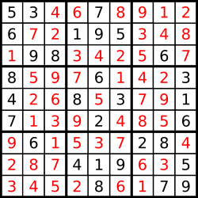

# Leetcode 92 Reverse Linked List II

## Problem Statement

[https://leetcode.com/problems/reverse-linked-list-ii/](https://leetcode.com/problems/reverse-linked-list-ii/)

Given the `head` of a singly linked list and two integers `left` and `right` where `left <= right`, reverse the nodes of the list from position `left` to position `right`, and return _the reversed list_.

**Example 1:** 

```text
Input: head = [1,2,3,4,5], left = 2, right = 4
Output: [1,4,3,2,5]
```

**Example 2:**

```text
Input: head = [5], left = 1, right = 1
Output: [5]
```

**Constraints:**

* The number of nodes in the list is `n`.
* `1 <= n <= 500`
* `-500 <= Node.val <= 500`
* `1 <= left <= right <= n`

  **Follow up:** Could you do it in one pass?

## Explanation

Let's look at the steps for the algorithm now.

1. We need two pointers, `prev` and `cur`.
2. The `prev` pointer should be initialized to `None` initially while `cur` is initialized to the `head` of the linked list.
3. We progress the `cur` pointer one step at a time and the `prev` pointer follows it.
4. We keep progressing the two pointers in this way until the `cur` pointer reaches the 'm'th node from the beginning of the list. This is the point from where we start reversing our linked list.
5. An important thing to note here is the usage of two additional pointers which we will call as `tail` and `con`. The `tail` pointer points to the mth node from the beginning of the linked list and we call it a _tail_ pointer since this node becomes the tail of the reverse sublist. The `con` points to the node one before mth node and this connects to the new head of the reversed sublist. Let's take a look at a figure to understand these two pointers better. 
6. The `tail` and the `con` pointers are set once initially and then used in the end to finish the linked list reversal.
7. Once we reach the mth node, we iteratively reverse the links as explained before using the two pointers. We keep on doing this until we are done reversing the link \(next pointer\) for the nth node. At that point, the `prev` pointer would point to the nth node.
8. We use the `con` pointer to attach to the `prev` pointer since the node now pointed to by the `prev` pointer \(the nth node from the beginning\) will come in place of the mth node due after the reversal. Similarly, we will make use of the `tail` pointer to connect to the node next to the `prev` node i.e.\(n+1\)th node from the beginning.


Let's have a look at the algorithm execute on a sample linked list to make the use case for all these pointers clearer. We are given a linked list initially with elements `7 → 9 → 2 → 10 → 1 → 8 → 6` and we need to reverse the list from node 3 through 6. 


We can see the first few steps of our iterative solution above. The first step shows the initialization of the two pointers and the third step shows us the starting point for the list reversal process. 


This shows us in detail how the links are reversed and how we move forward after reversing the links between two nodes. This step is done multiple times as shown in the following images.  




As we can see from the above images, now the two pointers have reached their final positions. We are done reversing the sublist that we were required to do i.e. nodes 3 through 6. However, we still have to fix some connections. The next image explains how we use the `tail` and `con` pointers to make the final connections. 


## Solution

```cpp
class Solution {
public:
    ListNode* reverseBetween(ListNode* head, int left, int right) {
        ListNode *con = nullptr, *tail = nullptr;
        ListNode *prev = nullptr, *curr = head, *next = nullptr;
        while(left > 1)
        {
            prev = curr;
            curr = curr->next;
            left--;
            right--;
        }
        con = prev;
        tail = curr;
        while(right)
        {
            next = curr->next;
            curr->next = prev;
            prev = curr;
            curr = next;
            right--;
        }
        if(con) 
            con->next = prev;
        else
            head = prev;
        tail->next = curr;
        return head;
    }
};
```

